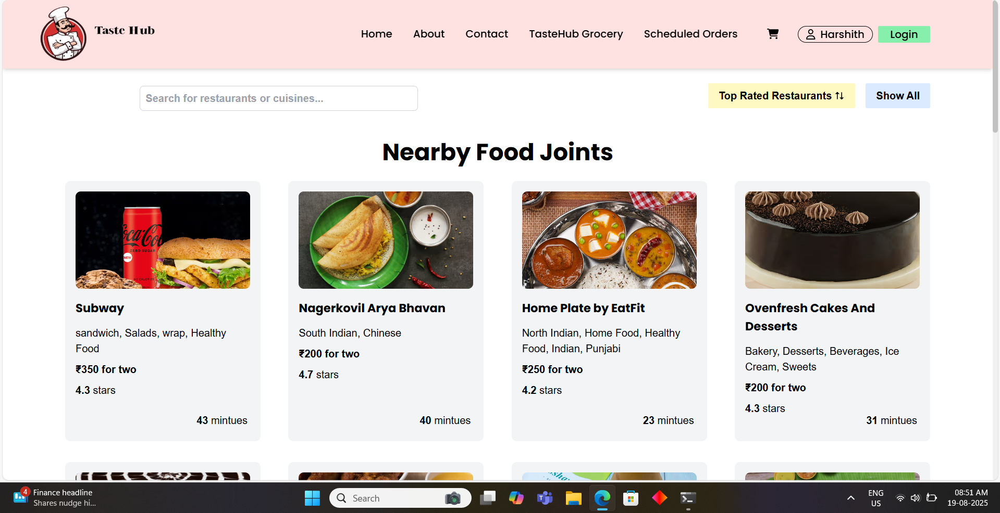

# 🍽️ TasteHub - Modern Food Delivery Web Application


**TasteHub** is a comprehensive, modern food ordering web application that brings your favorite restaurants right to your fingertips. Built with cutting-edge web technologies, it offers a seamless dining experience with real-time data integration and advanced features.

## ✨ Key Features

### 🏠 **Home Page & Restaurant Discovery**
- **Live Restaurant Data**: Fetches real-time restaurant information using external APIs
- **Smart Search**: Real-time search functionality for restaurants and cuisines
- **Advanced Filtering**: Filter restaurants by ratings (Top Rated Restaurants 4.3+)
- **Location-Based**: Shows nearby food joints with delivery information
- **Responsive Cards**: Beautiful restaurant cards with ratings, cuisine types, and delivery time
- **Promotional Labels**: Special "Promoted" badges for featured restaurants
- **Loading States**: Smooth shimmer effects while data loads

### 🍜 **Restaurant Menu & Item Management**
- **Detailed Menu Views**: Complete restaurant menus with categories and subcategories
- **Accordion Interface**: Collapsible menu sections for better organization
- **Item Descriptions**: Full food item details with prices and descriptions
- **Veg/Non-Veg Indicators**: Clear visual indicators for dietary preferences
- **High-Quality Images**: CDN-optimized food images for better visual appeal
- **Real-time Menu Data**: Live menu information fetched from restaurant APIs

### 🛒 **Smart Shopping Cart System**
- **Add/Remove Items**: Seamless item management with quantity controls
- **Persistent Cart**: Cart state maintained using Redux for consistency
- **Item Counter**: Visual quantity indicators for each menu item
- **Total Calculation**: Real-time price calculations with tax and delivery charges
- **Toast Notifications**: Instant feedback when items are added to cart
- **Cart Preview**: Header cart icon with live item count and total
- **Cart Tooltips**: Hover tooltips showing cart summary and total price

### 📅 **Advanced Order Scheduling**
- **Schedule Orders**: Plan your meals up to 7 days in advance
- **Time Slot Selection**: 30-minute intervals from 6 AM to 11 PM
- **Smart Time Filtering**: Only shows available future time slots
- **Order Status Tracking**: Real-time status updates (Scheduled → Preparing → Delivered)
- **Order Management**: Cancel scheduled orders, clear completed orders
- **Visual Status Indicators**: Color-coded status badges with icons
- **Order History**: Complete order timeline with timestamps


*Advanced order scheduling system with time slots and status tracking*

### 📱 **Responsive Design & Mobile Experience**
- **Mobile-First Design**: Optimized for all screen sizes
- **Touch-Friendly Interface**: Easy navigation on mobile devices
- **Hamburger Menu**: Collapsible navigation for mobile screens
- **Adaptive Layouts**: Different layouts for desktop and mobile views
- **Fast Loading**: Optimized images and lazy loading for better performance

### 🔍 **Search & Discovery Features**
- **Real-Time Search**: Instant search results as you type
- **Multi-Criteria Search**: Search by restaurant name or cuisine type
- **Search Suggestions**: Smart search with auto-suggestions
- **Clear Search**: Easy search reset functionality
- **Empty State Handling**: Helpful messages when no results found
- **Search History**: Remember previous searches for better UX

### 🌐 **Network & Performance Features**
- **Offline Detection**: Automatic offline status detection and user notification
- **Error Handling**: Graceful error handling with retry options
- **Loading States**: Professional loading animations and shimmer effects
- **Lazy Loading**: Code splitting for better performance
- **CDN Integration**: Optimized image delivery through CDN
- **API Integration**: Robust API integration with error handling

### 🎨 **User Experience & Interface**
- **Modern Design**: Clean, intuitive interface with beautiful typography
- **Smooth Animations**: Engaging micro-interactions and transitions
- **Custom Fonts**: Professional typography with Google Fonts (Poppins, Palanquin, Montserrat)
- **Color-Coded Elements**: Intuitive color schemes for different actions
- **Accessibility**: Screen reader friendly with proper ARIA labels
- **User Context**: Personalized experience with user name display

### 🏪 **Additional Features**
- **TasteHub Grocery**: Dedicated grocery section (Coming Soon)
- **About Page**: Information about the platform and developer
- **Contact Page**: Easy ways to get in touch
- **Footer Integration**: Consistent footer with branding and links
- **Developer Attribution**: Clear attribution and contact information

## 🛠️ Technologies Used

### **Frontend Framework**
- **React.js 18.3.1**: Modern React with hooks and functional components
- **React Router DOM 6.27.0**: Client-side routing with nested routes
- **React Redux 9.1.2**: Predictable state container for JavaScript apps

### **State Management**
- **Redux Toolkit 2.2.7**: Modern Redux with simplified syntax
- **Redux Slices**: Organized state management with cart and scheduled orders
- **React Context**: Additional state management for user context

### **Styling & UI**
- **Tailwind CSS 3.4.11**: Utility-first CSS framework
- **FontAwesome Icons**: Professional icon library with React integration
- **Responsive Design**: Mobile-first approach with breakpoint system
- **Custom Components**: Reusable UI components with consistent styling

### **Build Tools & Development**
- **Parcel 2.12.0**: Zero-configuration build tool
- **PostCSS**: CSS processing for Tailwind
- **Babel**: JavaScript compilation for modern browsers

### **Testing**
- **Jest 29.7.0**: JavaScript testing framework
- **React Testing Library 16.0.1**: Simple and complete testing utilities
- **JSDOM Environment**: DOM implementation for testing

### **External APIs & Services**
- **Restaurant Data API**: Live restaurant and menu data
- **Image CDN**: Optimized image delivery
- **Network Status API**: Online/offline detection

## 🚀 Installation and Setup

### **Prerequisites**
- Node.js (version 14 or higher)
- npm or yarn package manager
- Modern web browser

### **Quick Start**

1. **Clone the repository**:
   ```bash
   git clone https://github.com/saiharshith-4502/food-delivery-app.git
   cd food-delivery-app
   ```

2. **Install dependencies**:
   ```bash
   npm install
   ```

3. **Start the development server**:
   ```bash
   npm start
   ```

4. **Open your browser**:
   Navigate to `http://localhost:1234` to view the app.

### **Build for Production**
```bash
npm run build
```

### **Run Tests**
```bash
npm test
```

## 📱 Screenshots

### Home Page - Restaurant Discovery

*Browse nearby restaurants with real-time search and filtering*

### Restaurant Menu - Detailed View

*Explore detailed menus with categories and item descriptions*

### Shopping Cart - Order Management

*Manage your cart and schedule orders for future delivery*

### About Page - Learn More

*Get to know more about TasteHub and our mission to deliver great food*

## 🏗️ Project Architecture

### **Component Structure**
```
src/
├── components/          # Reusable UI components
│   ├── Header.js       # Navigation and user interface
│   ├── Body.js         # Main restaurant listing
│   ├── RestaurantCard.js # Individual restaurant cards
│   ├── RestaurantMenu.js # Detailed menu view
│   ├── Cart.js         # Shopping cart management
│   ├── ScheduledOrders.js # Order scheduling system
│   └── ...             # Other components
├── utils/              # Utilities and custom hooks
│   ├── constants.js    # API endpoints and configuration
│   ├── useRestaurantMenu.js # Custom hook for menu data
│   └── slices/         # Redux slices for state management
└── app.js              # Main application and routing
```

### **State Management**
- **Cart Slice**: Manages shopping cart items, quantities, and totals
- **Scheduled Orders Slice**: Handles order scheduling and status updates
- **User Context**: Manages user information and authentication state

## 🔧 Configuration

### **API Configuration**
The app uses external APIs for restaurant data. Configuration can be found in `src/utils/constants.js`:

```javascript
export const CDN_URL = "https://media-assets.swiggy.com/swiggy/image/upload/fl_lossy,f_auto,q_auto,w_660/";
export const MENU_API = "https://foodfire.onrender.com/api/menu?page-type=REGULAR_MENU&complete-menu=true&lat=21.1702401&lng=72.83106070000001&&submitAction=ENTER&resId=";
```

### **Tailwind Configuration**
Custom fonts and styling can be configured in `tailwind.config.js`.

## 🚀 Performance Optimizations

- **Code Splitting**: Lazy loading of components for better initial load times
- **Image Optimization**: CDN-delivered optimized images
- **API Caching**: Efficient data fetching with proper error handling
- **Bundle Optimization**: Parcel-based optimization for production builds
- **Memory Management**: Proper cleanup of event listeners and timeouts

## 📈 Future Enhancements

### **Upcoming Features**
- [ ] User authentication and profile management
- [ ] Payment gateway integration
- [ ] Real-time order tracking with GPS
- [ ] Push notifications for order updates
- [ ] Reviews and ratings system
- [ ] Loyalty points and rewards program
- [ ] Multi-language support
- [ ] Dark mode theme
- [ ] Advanced filters (price range, delivery time, etc.)
- [ ] Favorites and order history

### **Technical Improvements**
- [ ] PWA (Progressive Web App) features
- [ ] Service worker for offline functionality
- [ ] Enhanced accessibility features
- [ ] Performance monitoring and analytics
- [ ] A/B testing framework
- [ ] SEO optimization

## 🤝 Contributing

We welcome contributions! Here's how you can help:

1. **Fork the repository**
2. **Create a feature branch** (`git checkout -b feature/AmazingFeature`)
3. **Commit your changes** (`git commit -m 'Add some AmazingFeature'`)
4. **Push to the branch** (`git push origin feature/AmazingFeature`)
5. **Open a Pull Request**

### **Development Guidelines**
- Follow the existing code style and conventions
- Write meaningful commit messages
- Add tests for new features
- Update documentation as needed
- Ensure responsive design for all new components

## 📄 License

This project is licensed under the ISC License. See the `LICENSE` file for details.

## 📞 Contact

**Developer**: Sai Harshith  
**Email**: [saiharshith4502@gmail.com](mailto:saiharshith4502@gmail.com)  
**GitHub**: [github.com/saiharshith-4502](https://github.com/saiharshith-4502)

For any questions, feedback, or collaboration opportunities, feel free to reach out!

## 🙏 Acknowledgments

- **Swiggy API**: For providing restaurant and menu data
- **FontAwesome**: For beautiful icons
- **Tailwind CSS**: For the utility-first CSS framework
- **React Community**: For the amazing ecosystem
- **Contributors**: Thanks to all contributors who help improve this project

---

**⭐ If you like this project, please give it a star on GitHub! ⭐**

**Happy coding and happy eating! 🍕🚀**
